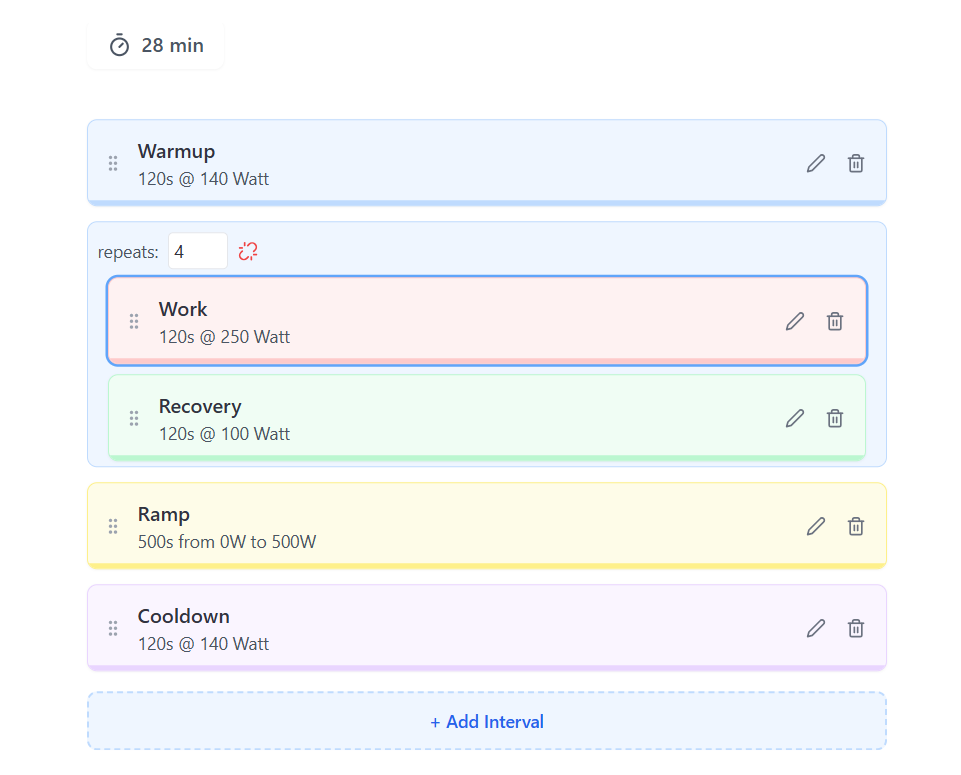
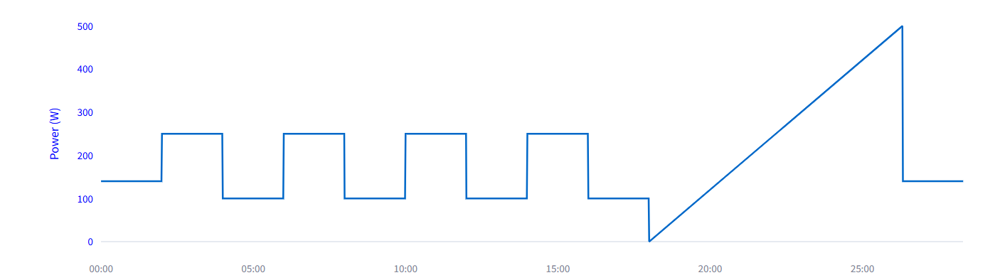

# Streamlit Workout Builder

A simple streamlit component to create workouts.

To start simply install using `pip`: 

```bash
pip install workout-builder-streamlit

```

Then:

```python
from workout_builder_streamlit import workout_builder

st.title("Workout Builder")
data = workout_builder()
st.line_chart(data)
```

By default the `workout_builder` returns a list of a stream of the power singal at 1Hz. The sampling
frequency can be increased by passing `"1ms"` to the `frequency` key word. Additionaly the `return_list` keyword
can be set to `False` to return an object of the differen workout blocks instead of the data stream.


## Example



An example graph based on the data created by the workout builder:




